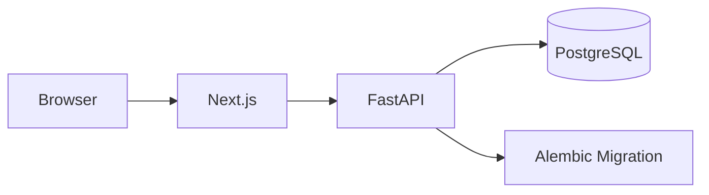

# Architecture

```mermaid
flowchart LR
  Browser --> Frontend[Next.js]
  Frontend --> Backend[FastAPI]
  Backend --> DB[(PostgreSQL)]
  Backend --> Alembic[Alembic Migration]
```

## 方針
- API契約を先に固定し、フロントは薄いクライアントとして実装。
- SQLAlchemyモデルを単純に保ち、過剰な抽象化を避ける。
- エラー時はHTTPExceptionで明示的な失敗理由を返す。
