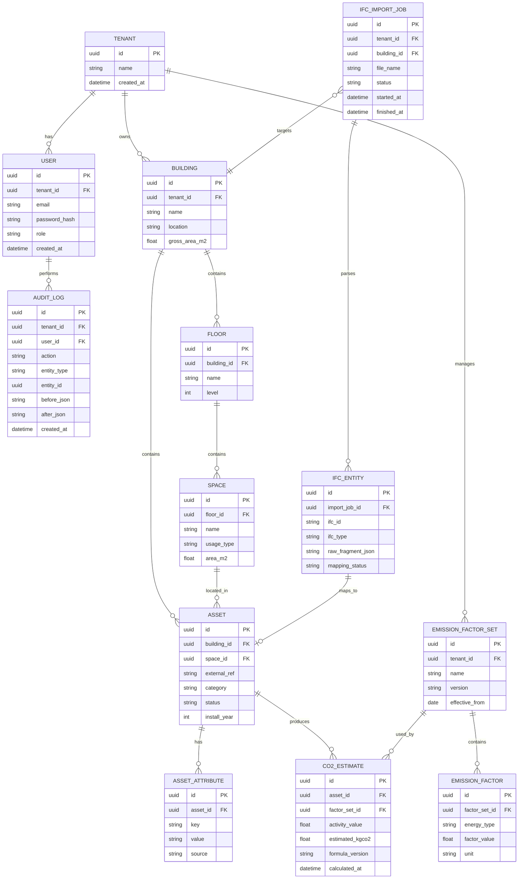

# FMクラウド + BIM(ifcXML)取り込み + CO2簡易推計 要件定義・設計

## 1) 想定ユーザー、課題、ゴール

### 想定ユーザー
- **FM担当者（一次ユーザー）**: 複数拠点の設備台帳・保全計画を管理する。
- **建築/設備エンジニア（支援ユーザー）**: BIMモデルの整合性確認・資産属性補完を行う。
- **経営企画/サステナ担当（閲覧ユーザー）**: 拠点別CO2排出量の傾向を把握し、投資優先度を判断する。
- **システム管理者（運用ユーザー）**: 権限・監査ログ・ジョブ実行状況を管理する。

### 解決したい課題
- BIM(ifcXML)はあるが、FM運用台帳への反映が手作業で遅い。
- 図面/設備情報と実運用データが分断し、保守判断に時間がかかる。
- CO2把握がExcel属人化しており、根拠説明が難しい。
- 「なぜこの数値か」を説明できる監査証跡が不足している。

### ゴール（採用ポートフォリオとして示す価値）
- **可読性**: 仕様・データモデル・API契約が先に定義されている。
- **保守性**: インポート処理、集計処理、認可処理を分離し変更容易にする。
- **説明可能性**: CO2推計の計算式・係数ソース・実行履歴を追跡可能にする。

---

## 2) 機能要件（MVP/将来拡張）

### MVP
1. **認証・認可**
   - メール/パスワード認証（ローカル用）。
   - RBAC（Admin, FM Manager, Engineer, Viewer）。
2. **テナント/拠点管理**
   - テナント作成、拠点（Building）登録、簡易メタデータ管理。
3. **ifcXML取り込み**
   - ファイルアップロード、非同期解析ジョブ実行。
   - 主要要素（Building/Storey/Space/Element/Type）抽出。
   - 取り込み結果（件数、警告、失敗理由）表示。
4. **資産台帳ビュー**
   - 取り込み済み設備一覧、検索（拠点・種別・属性）。
   - 手動補完項目（運転時間、更新年、台数、備考）。
5. **CO2簡易推計**
   - ルールベース推計（例: `年間電力量[kWh] × 排出係数[kg-CO2/kWh]`）。
   - 設備単位/拠点単位で集計。
   - 推計バージョン（係数セット）を保持。
6. **監査ログ**
   - 取り込み開始/終了、台帳更新、推計実行を記録。

### 将来拡張
1. **外部連携**
   - BEMS、CMMS、ERPとの双方向同期。
2. **計算高度化**
   - 需要家区分別係数、時間帯別係数、スコープ分類対応。
3. **可視化**
   - ダッシュボード（原単位、前年差分、削減シナリオ）。
4. **ワークフロー**
   - 変更申請・承認、コメントスレッド。
5. **マルチBIM対応**
   - IFC STEP、Revit exportなど複数フォーマット。

---

## 3) 非機能要件（セキュリティ/監査/運用/テスト可能性）

### セキュリティ
- テナント分離（アプリ層 + DBクエリ制約）。
- パスワードハッシュ（Argon2 or bcrypt）。
- JWT短命化 + リフレッシュトークンローテーション。
- ファイルアップロード制限（サイズ、MIME、拡張子、ウイルススキャン将来枠）。
- 監査対象操作の改ざん検知用ハッシュチェーン（将来拡張）。

### 監査
- 誰が/いつ/何を/どの値へ変更したかをJSON差分で保持。
- CO2推計は「入力値」「係数セット」「計算式バージョン」を保存。
- ジョブ実行IDをキーに、アップロード〜推計まで追跡可能。

### 運用
- Docker Composeでローカル一括起動（app, db, queue, worker）。
- OpenAPIを単一真実源としてAPI契約を管理。
- 失敗ジョブの再実行・デッドレターキューを設計。
- ログは構造化（JSON）し、相関IDで追跡。

### テスト可能性
- ifcXMLパーサは純粋関数寄りに分離し、fixtureで単体試験。
- CO2計算は係数セット固定でスナップショット試験。
- APIは契約テスト（OpenAPI準拠） + 認可テスト（ロール別）。
- E2Eは「アップロード→取り込み→推計→監査確認」の1本を最低保証。

---

## 4) データモデル（ER図 / Mermaid）



---

## 5) API設計（主要エンドポイント、認可方針）

### 認可方針
- 認可方式: JWT + RBAC。
- テナント境界: `tenant_id`をトークンクレームに保持し、全クエリで強制。
- ロール権限（概要）
  - `Admin`: 全操作可（係数セット管理含む）
  - `FM Manager`: 取り込み実行、台帳編集、推計実行
  - `Engineer`: 取り込み結果確認、資産属性編集（限定）
  - `Viewer`: 閲覧のみ

### 主要エンドポイント（v1）
- `POST /api/v1/auth/login`
- `POST /api/v1/auth/refresh`
- `GET /api/v1/me`

- `GET /api/v1/buildings`
- `POST /api/v1/buildings`
- `GET /api/v1/buildings/{buildingId}`
- `PATCH /api/v1/buildings/{buildingId}`

- `POST /api/v1/imports/ifcxml`
  - multipart upload
  - response: `{ jobId }`
- `GET /api/v1/imports/{jobId}`
- `GET /api/v1/imports/{jobId}/entities`

- `GET /api/v1/assets`
- `GET /api/v1/assets/{assetId}`
- `PATCH /api/v1/assets/{assetId}`

- `GET /api/v1/factor-sets`
- `POST /api/v1/factor-sets`
- `POST /api/v1/co2-estimates/run`
  - body: `{ buildingId, factorSetId, period }`
- `GET /api/v1/co2-estimates?buildingId=...&period=...`

- `GET /api/v1/audit-logs?entityType=...&entityId=...`

### API設計原則
- 非同期処理はジョブリソースで表現（202 Accepted + polling）。
- 破壊的変更を避けるためURIにバージョンを含める。
- エラーはRFC7807準拠（`application/problem+json`）。

---

## 6) アーキテクチャ図（Mermaid）

```mermaid
flowchart LR
    U[User Browser] -->|HTTPS| API[API Gateway / Backend]
    API --> AUTH[Auth Module]
    API --> FM[FM Core Module]
    API --> CO2[CO2 Estimation Module]
    API --> AUDIT[Audit Module]

    API --> DB[(PostgreSQL)]
    API --> Q[(Redis Queue)]

    FM --> Q
    W[Worker: IFC Parser] --> Q
    W --> DB

    CO2 --> DB
    AUDIT --> DB

    API --> OBJ[(Object Storage: Local/MinIO)]
    W --> OBJ

    subgraph Docker Compose(Local)
      API
      W
      DB
      Q
      OBJ
    end
```

---

## 7) 技術選定理由とトレードオフ（ADR形式）

### ADR-001: バックエンドはTypeScript + NestJSを採用
- **Status**: Accepted
- **Context**:
  - API層、認可、バリデーション、ジョブ投入を短期間で構築したい。
  - 保守性重視でレイヤ分離とDIを徹底したい。
- **Decision**:
  - NestJS（TypeScript）を採用し、Controller/Service/Repository構成を明示。
- **Consequences**:
  - Pros: 型安全、モジュール分割容易、テストしやすい。
  - Cons: 学習コスト、軽量FWより起動・記述が重い。

### ADR-002: DBはPostgreSQL、監査ログは同居テーブルで開始
- **Status**: Accepted
- **Context**:
  - まずはローカル完結と運用容易性を優先。
  - 強い整合性とJSON格納の柔軟性が必要。
- **Decision**:
  - 主要業務データ + 監査ログをPostgreSQLに統合。
- **Consequences**:
  - Pros: トランザクション一貫性、運用シンプル。
  - Cons: 監査ログ肥大化で将来的に分離（DWH/ログ基盤）が必要。

### ADR-003: ifcXML取り込みは非同期ジョブ（Queue + Worker）
- **Status**: Accepted
- **Context**:
  - ファイルサイズや構造次第で処理時間が読みにくい。
- **Decision**:
  - アップロード後にジョブ化し、APIは即時応答。進捗はジョブ照会APIで取得。
- **Consequences**:
  - Pros: タイムアウト回避、再実行設計が容易。
  - Cons: 同期処理より構成が複雑、運用監視が必要。

### ADR-004: CO2推計は「簡易式 + 係数セット版管理」で開始
- **Status**: Accepted
- **Context**:
  - まず説明可能性を最優先し、計算根拠を明確化したい。
- **Decision**:
  - `activity × factor`の単純式を採用し、係数セットをバージョン管理。
- **Consequences**:
  - Pros: 実装・説明が容易、監査適合しやすい。
  - Cons: 高精度推計には将来拡張が前提。

### ADR-005: ローカル実行はDocker Composeを標準化
- **Status**: Accepted
- **Context**:
  - 外部キー不要でポートフォリオ再現性を担保する必要。
- **Decision**:
  - `api`, `worker`, `postgres`, `redis`, `minio`をComposeで起動可能にする。
- **Consequences**:
  - Pros: オンボーディング容易、環境差異低減。
  - Cons: 本番構成（K8s等）との差分を別途吸収する必要。

---

## 補足（実装フェーズへの引き継ぎ）
- 次フェーズではOpenAPI定義→DBマイグレーション→ifcXML parser最小実装→E2Eの順で着手する。
- ポートフォリオでは、設計意図と変更理由をREADME/ADRで常に更新し、説明可能性を担保する。
